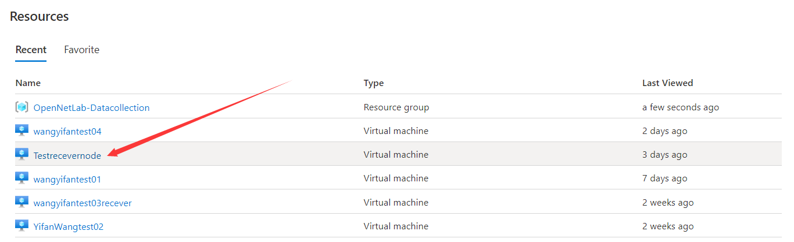
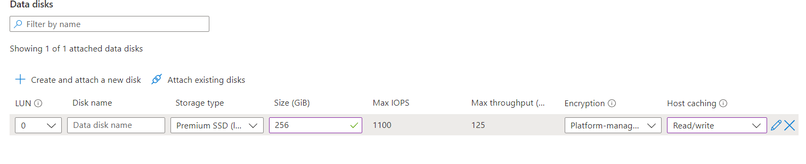
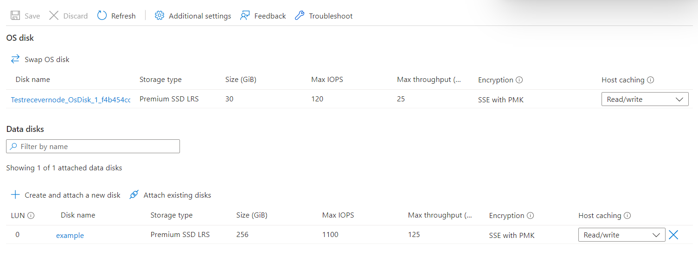
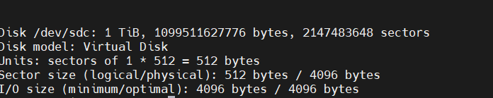

# How To Create Disk In Azure

Step 1, select the virtual machine that you want to add in the resource list 

Step 2, click on the Disk options  

Step 3, select a new hard disk in the data disk  

Step 4, fill in the disk size and other content according to your own needs  

Step 5, click Save  

Step 6, add it successfully  

Step 7, Formatting the disk

Use the fdisk-l command to view the disk  

Step 8, Format the hard disk file system

> mkfs -t ext4 /dev/sdc

Step 9, Mount the hard drive

Create a directory that you want to mount

> mkdir /onldata

Mount the hard disk to the folder

> mount /dev/sdc /onldata

Step 10, boot on automatic mount

> vim /etc/fstab  

